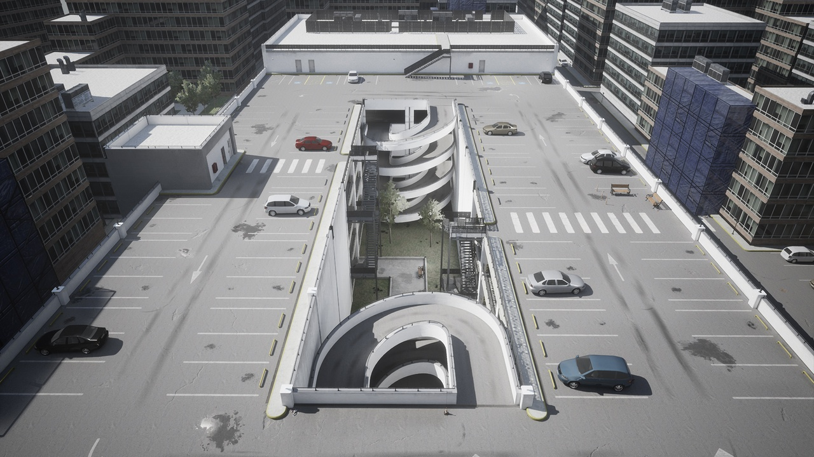
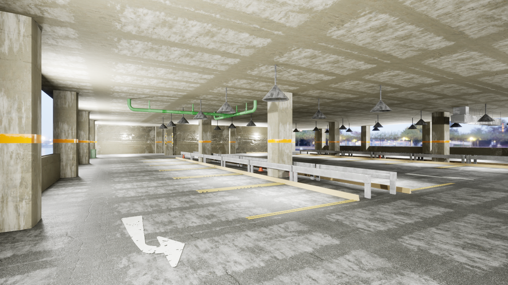
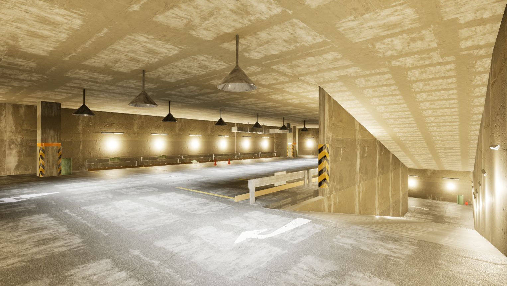
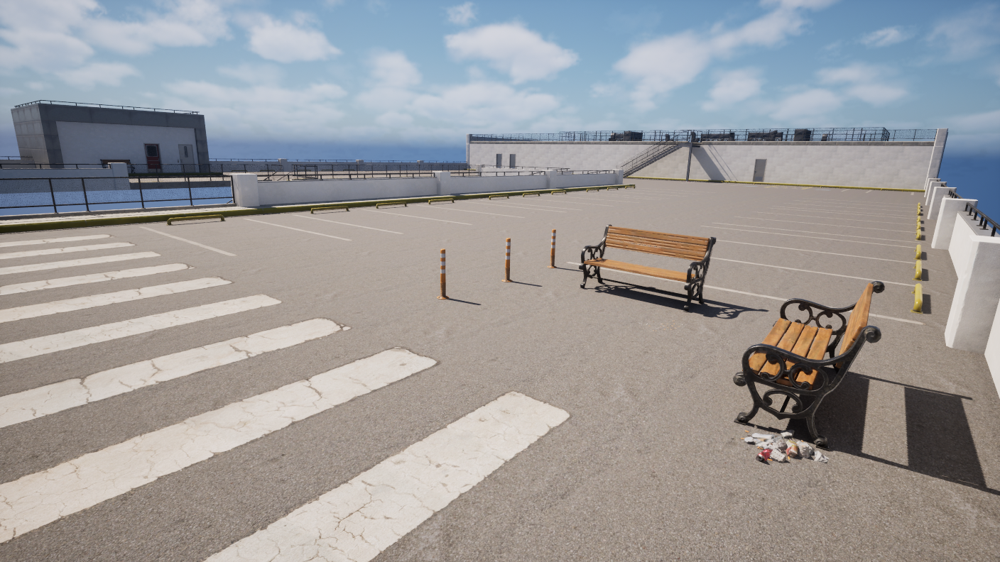
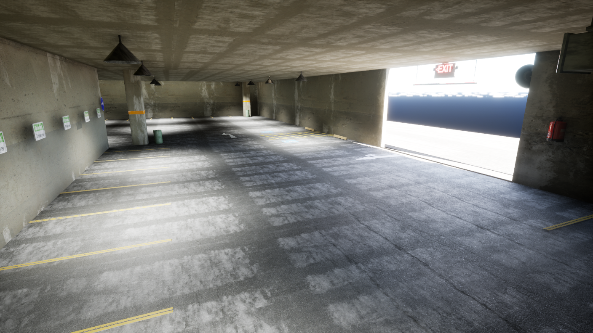

# 3D Garage Annotation for Autonomous Vehicle Training with CARLA
<em>By Jack Landers</em>

This repository contains a collection of annotated parking garage environments developed in RoadRunner and integrated with CARLA for autonomous vehicle research. These digital twin environments provide semantic scene annotations, traffic infrastructure, and parking-specific layouts designed for training and evaluating perception, planning, and control systems.

The environments support the development of autonomous parking capabilities and parking-focused world models by providing structured, reproducible scenarios for tasks such as parking spot detection, maneuver planning, navigation, and vehicle positioning within complex garage settings.

### San Jose
Big City Garage, Completed 5/30 &emsp; [Download Unreal](/ModularParkGarage/Content/Garages/Demonstration.umap) &emsp; [CARLA Annotated](/Exports/SanJose(Full)/)
 

### Garage2
1 story, Completed 4/30 &emsp; [Download Unreal](/ModularParkGarage/Content/Garages/Garage2.umap) &emsp; [CARLA Annotated](/Exports/Garage2/)
 

### Garage1
2 story underground, Completed 4/26 &emsp; [Download Unreal](/ModularParkGarage/Content/Garages/Garage1.umap) &emsp; [CARLA Annotated](/Exports/Garage1/)
  

### Top Floor
San Jose Demo, top floor isolated, Completed 5/8 &emsp; [Download Unreal](/ModularParkGarage/Content/Garages/TopFloor.umap) &emsp; [CARLA Annotated](/Exports/SanJose/)
 

### Adi's Garage
Garage on hill, Unreal project by Adi Thakrar, Completed 6/1 &emsp; [Download Unreal](/ModularParkGarage/Content/Garages/Adi.umap) &emsp; [CARLA Annotated](/Exports/Adi/)
 

## Purchased asset packs
- [ModularParkingGarage](https://www.fab.com/listings/3b4e78f1-a19a-4604-b464-caf8d27a4f2c)
- [ParkingGarage](https://www.fab.com/listings/a7ebb22d-0c83-4c54-b12c-4050b559457c)

## Appendix
'ModularParkGarage' is the UE5 project for designing the virtual worlds  
Assets and Levels: &emsp; [/ModularParkGarage/Content/](/ModularParkGarage/Content/)  
RoadRunner texture and fbx imports pre-annotation: &emsp; [/Content/Garages/RoadRunner/](/ModularParkGarage/Content/RoadRunner)  
CARLA ready annotated projects: &emsp; [/Exports/](/Exports/)
